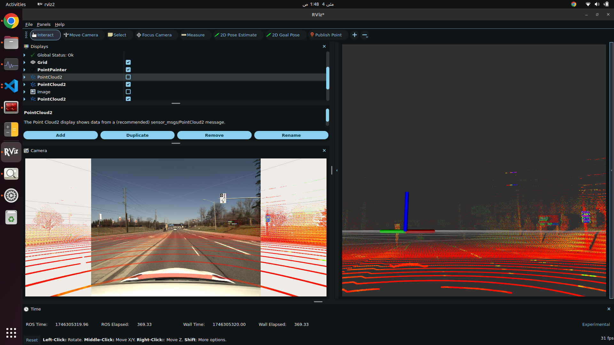
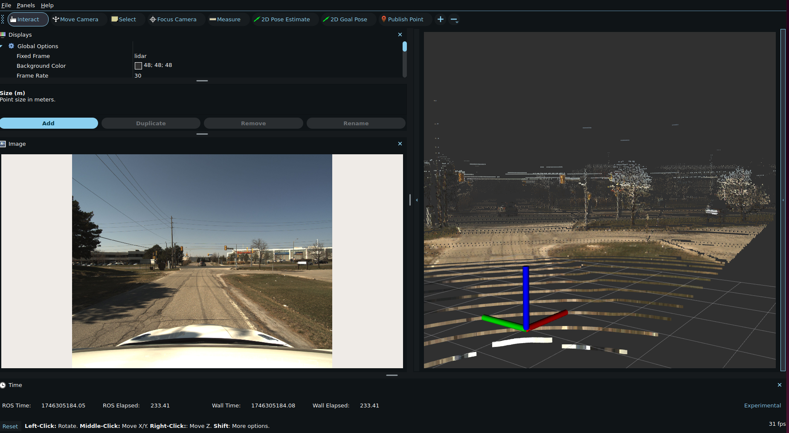

# Boreas to ROS 2

Convert a [Boreas](https://www.boreas.utias.utoronto.ca/) sequence on disk into a ROS 2 bag for playback in RViz, Autoware, or other tools.

The node reads lidar `.bin` frames, camera `.png` images, Applanix ground truth, and calibration files, then writes a time-synchronized bag with `/clock`, sensor topics, optional ground truth, and a connected TF tree.

## TF tree

```
map ──(/tf, dynamic)──► base_link ──(/tf_static)──► lidar
                              └──(/tf_static)──► camera
```

- **`map → base_link`** on `/tf` — from lidar ground-truth poses, composed so `map → base_link → lidar` matches the dataset lidar pose.
- **`base_link → lidar`** on `/tf_static` — yaw-only offset (default **-45°**), zero translation.
- **`base_link → camera`** on `/tf_static` — computed as `T_base_link_lidar × inv(T_camera_lidar)` from Boreas calibration.

Static transforms are configured in [`config/boreas_tf.yaml`](config/boreas_tf.yaml). Precomputed values are provided for the default sequence `boreas-2020-11-26-13-58`. For other sequences, set `use_precomputed_static_tf: false` to recompute from that sequence's `calib/T_camera_lidar.txt`.

## TF QoS (ROS 2 / `tf2_ros` convention)

Bag TF topics use the same QoS profiles as [`tf2_ros/qos.hpp`](https://github.com/ros2/geometry2/blob/ros2/tf2_ros/include/tf2_ros/qos.hpp) so RViz, `tf2_ros`, and Autoware can subscribe correctly.

### `/tf_static` — `tf2_ros::StaticBroadcasterQoS`

| Policy | Value |
|--------|-------|
| Reliability | **Reliable** |
| Durability | **Transient Local** (late joiners receive the last message) |
| History | **Keep Last** |
| Depth | **1** |

Static transforms are published once; subscribers that start later (RViz, navigation) must receive that latched state. Wrong durability (e.g. Volatile) causes disconnected trees.

### `/tf` — `tf2_ros::DynamicBroadcasterQoS`

| Policy | Value |
|--------|-------|
| Reliability | **Reliable** |
| Durability | **Volatile** (only live samples; no latch) |
| History | **Keep Last** |
| Depth | **100** |

Dynamic transforms stream continuously; `tf2` buffers recent history for interpolation. Reliable delivery is required for standard tools (`rviz2`, `tf2_monitor`).

Verify after recording:

```bash
ros2 bag info /path/to/output_bag -v   # check offered QoS on /tf and /tf_static
```

## Dataset layout

Expected directory structure (per Boreas release):

```
boreas-YYYY-MM-DD-HH-MM/
  lidar/<timestamp>.bin
  camera/<timestamp>.png
  applanix/
    lidar_poses.csv
    camera_poses.csv
    gps_post_process.csv
  calib/
    T_camera_lidar.txt
```

## Build

```bash
cd <your_ros_ws>
colcon build --packages-select boreas
source install/setup.bash
```

## Run

```bash
ros2 launch boreas boreas.launch.xml \
  data_path:=/path/to/boreas-YYYY-MM-DD-HH-MM \
  output_bag:=/path/to/output_bag \
  bag_duration_sec:=300
```

Launch arguments:

| Argument | Description |
|----------|-------------|
| `data_path` | Path to extracted Boreas sequence |
| `output_bag` | Output bag directory |
| `bag_duration_sec` | Cap bag length in seconds (`0` = full sequence) |
| `config` | Main config (topics, intrinsics, ground truth) |
| `tf_config` | TF frames and static transforms |

## Bag contents

| Topic | Type | Notes |
|-------|------|-------|
| `/boreas/pointcloud` | `sensor_msgs/PointCloud2` | Frame: `lidar` |
| `/boreas/image/compressed` | `sensor_msgs/CompressedImage` | Frame: `camera` |
| `/boreas/camera_info` | `sensor_msgs/CameraInfo` | |
| `/tf` | `tf2_msgs/TFMessage` | `map → base_link` |
| `/tf_static` | `tf2_msgs/TFMessage` | `base_link → {lidar, camera}` |
| `/clock` | `rosgraph_msgs/Clock` | Use with `--clock` on play |
| `/boreas/ground_truth/lidar_odom` | `nav_msgs/Odometry` | Optional |
| `/boreas/ground_truth/camera_odom` | `nav_msgs/Odometry` | Optional |
| `/boreas/gnss/fix` | `sensor_msgs/NavSatFix` | Optional |

## Playback

```bash
ros2 bag play /path/to/output_bag --clock
ros2 run tf2_tools view_frames   # verify connected TF tree
```

In RViz, set **Fixed Frame** to `map` and enable **Use sim time**.

## Configuration

- [`config/boreas.yaml`](config/boreas.yaml) — bag paths, topics, camera intrinsics, ground-truth/GNSS toggles.
- [`config/boreas_tf.yaml`](config/boreas_tf.yaml) — frame names, yaw offset, precomputed static transforms.

Key TF parameters:

```yaml
base_link_to_lidar_yaw_deg: -45.0
use_precomputed_static_tf: true   # false = compute from calib/T_camera_lidar.txt
write_tf: true
```

## Examples

Pointcloud projected to image:



Pointcloud with RGB image:


